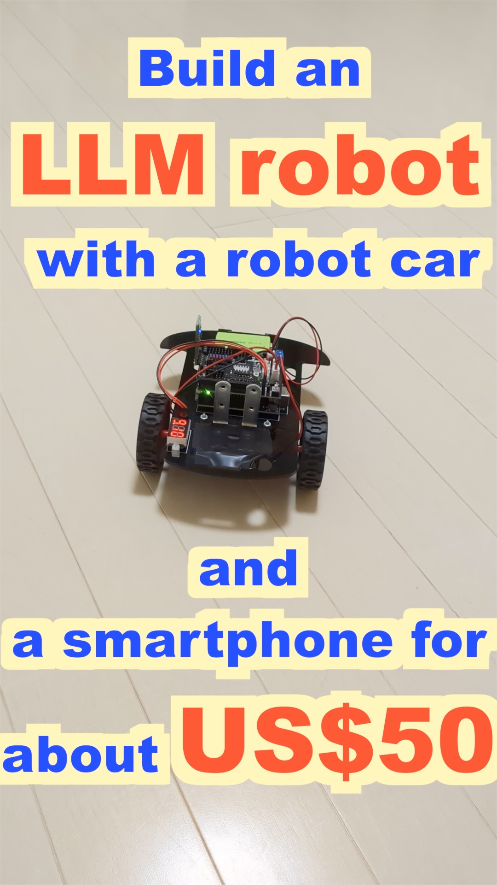
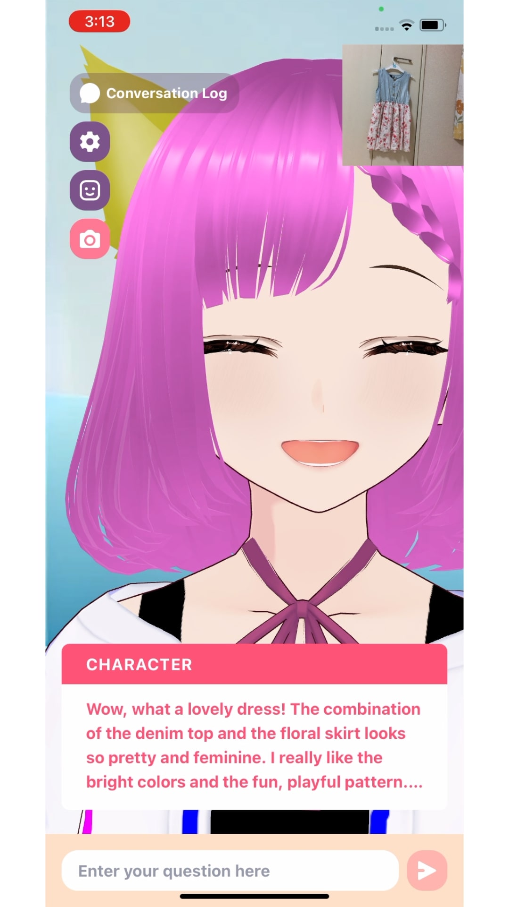
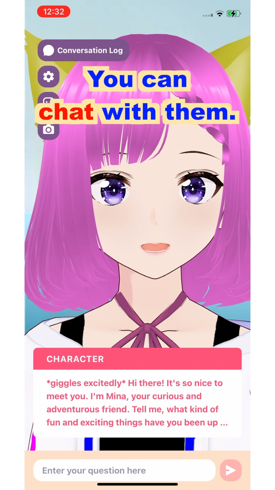
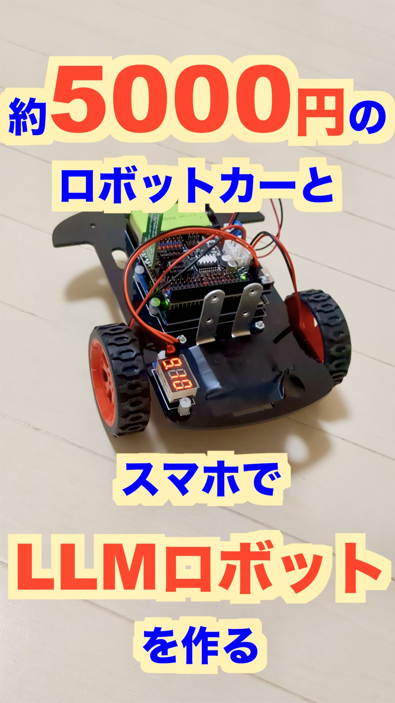
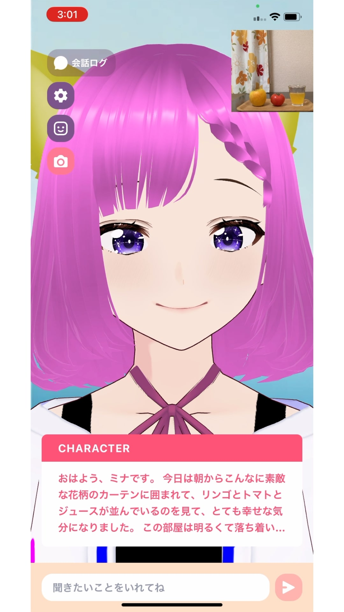
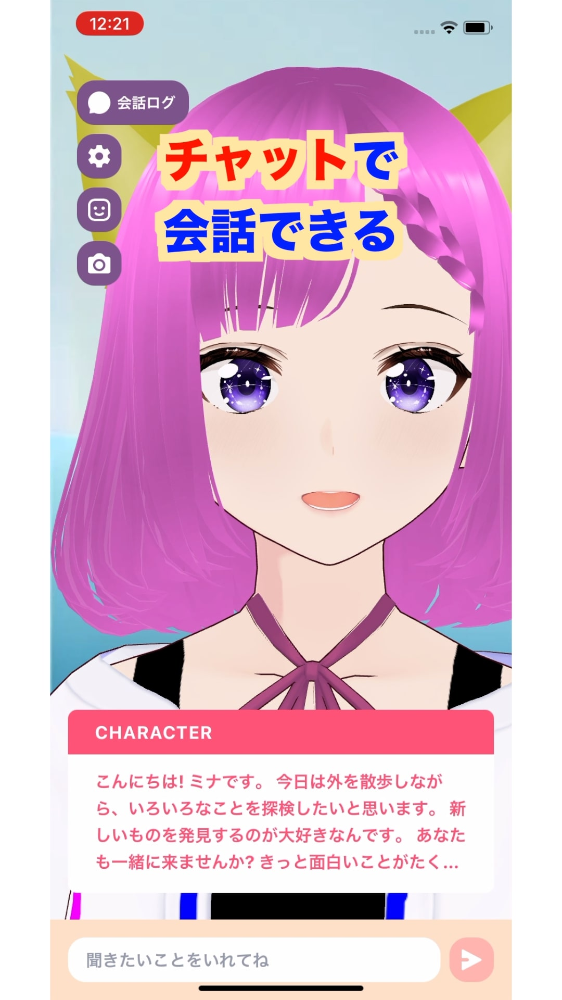
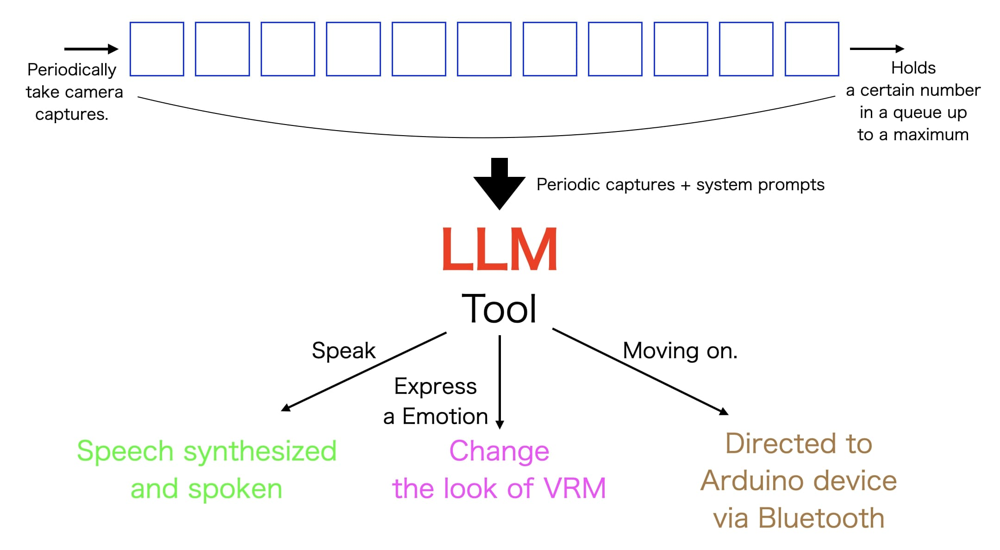

  

  

# RobotVRM

Project to develop LLM robots (smart phone robots) that can be created at low cost **live with people** .

- This repository encourages forking. Each person is encouraged to develop his/her own robot.
- When using this repository or software, please indicate that you are using **“RobotVRM”** (see [LICENSE](./LICENSE])
- Using the software in this repository to directly harm or injure any person is prohibited (for details, see [LICENSE](./LICENSE).

## Running cost

Need a multimodal LLM that can use Tool.

API rates at Claude 3.7 Sonnet for videos are **“no more than US$18”** per hour.

- Speech synthesis is free with home server use

### Verification environment

RobotVRM Memory Model Rin (as of 4/7/2025)

## Community

We have a community called [**RobotVRM Community**(Discord)](https://discord.gg/UUUxwk6Xjf), so feel free to join. Even those who fork repositories are welcome to join (rather, that is the main focus). Let's exchange information together.

## ベース

RobotVRM is built on the open source, [**tegnike/aituber-kit** (around the time of the MIT license, before 2024/9/25)](https://github.com/tegnike/aituber-kit/tree/5c1be3dae7e38871839f37857e550b8f7387f718) by [**Nike-chan**](https://x.com/tegnike) based on [**pixiv**]'s [**pixiv/ChatVRM**](https://github.com/pixiv/ChatVRM).

## Building an application development environment

See [Building an App Development Environment](./docs/development.md)

## How to build a robot

See [How to Build a Robot](./docs/make_robot.md)

## Design

(Prerequisites)

Periodically take pictures with a camera and leave an ActionLog of the viewpoint (when the camera is ON)

(Order of processing)

1. (Action Process) Execute the next Action using a Tool by passing an ActionLog that leaves a viewpoint and the results of one's own action along with one's past background.
2. (Memory Process) Update the new background of the past by passing the ActionLog that contains the viewpoint and the result of the action along with the background of the past. At that time, the ActionLog that has been saved until now is cleared.
3. Return to the (Action Process) and repeat.

## The “robotvrm” topic on GitHub

In the future, we will create a **list of RobotVRMs**. If you have forked it, please set “ **robotvrm** ” as a topic in the “About” section in the upper right corner of the repository.

## Character Terms of Use for this Repository

The characters in this repository are basically **free of charge and can be used for commercial purposes by both individuals and corporations** (for details, please refer to the [**Terms of Use of Characters in this Repository**](./CHARACTOR_LICENSE.md) for details)

## 日本でのサービス(Services in Japan) by saten

日本ではスマホをLLMのロボットにするキットを受注販売中です。
[How to Build a Robot](./docs/make_robot.md)のロボットカーの組み立てたやつの受注販売を行っています。こちらを購入することで容易にスマホをLLMのロボットにすることを実現できます。

### [スマホLLMロボット化キット(受注販売中)](https://shop.robotvrm.com/items/99407194)

また、日本では無料アプリで「RobotVRM」アプリシリーズをアプリストアで配信しています。ロボットカーが無くてもカメラでの認識やチャットなどで使うこともできます。是非お試しください。
サーバーの負荷を考慮して日本のみ配信しています。

### [iOSアプリ(無料アプリ)](https://apps.apple.com/jp/app/robotvrm%E5%88%9D%E5%8F%B7%E6%A9%9F%E3%83%9F%E3%83%8A/id6737445996)

### [Androidアプリ(無料アプリ)](https://play.google.com/store/apps/details?id=com.robotvrm.first)

<h2 align="center">
<a href="https://github.com/sponsors/saten-private">Sponsor</a>
</h2>

(The larger the sponsor's icon, the larger the amount)

<h3 align="center">
  <a href="https://github.com/sponsors/saten-private">Dragon Sponsor US$12,000 (maximum)</a>
</h3>

<!-- dragon -->There are currently no sponsors at this level.<!-- dragon -->

<h3 align="center">
 <a href="https://github.com/sponsors/saten-private">Hero Sponsor US$10,000</a>
</h3>

<!-- hero -->There are currently no sponsors at this level.<!-- hero -->

<h3 align="center">
 <a href="https://github.com/sponsors/saten-private">Demon King Sponsor US$5,000</a>
</h3>

<!-- devilking -->There are currently no sponsors at this level.<!-- devilking -->

<h3 align="center">
 <a href="https://github.com/sponsors/saten-private">Elf Sponsor US$1,000</a>
</h3>

<!-- elf -->There are currently no sponsors at this level.<!-- elf -->

<h3 align="center">
 <a href="https://github.com/sponsors/saten-private">Demon Sponsor US$500</a>
</h3>

<!-- demon -->There are currently no sponsors at this level.<!-- demon -->

<h3 align="center">
 <a href="https://github.com/sponsors/saten-private">Wizard Sponsor US$100</a>
</h3>

<!-- wizard -->There are currently no sponsors at this level.<!-- wizard -->

<h3 align="center">
 <a href="https://github.com/sponsors/saten-private">Auger Sponsor US$50</a>
</h3>

<!-- auger -->There are currently no sponsors at this level.<!-- auger -->

<h3 align="center">
 <a href="https://github.com/sponsors/saten-private">Warrior Sponsor US$10</a>
</h3>

<!-- warrior -->There are currently no sponsors at this level.<!-- warrior -->

<h3 align="center">
 <a href="https://github.com/sponsors/saten-private">Wolf Sponsor US$5</a>
</h3>

<!-- wolf -->There are currently no sponsors at this level.<!-- wolf -->

<h3 align="center">
 <a href="https://github.com/sponsors/saten-private">Slime Sponsor US$1</a>
</h3>

<!-- slime --><!-- slime -->

