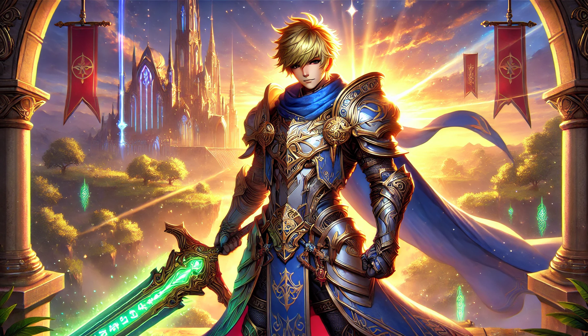
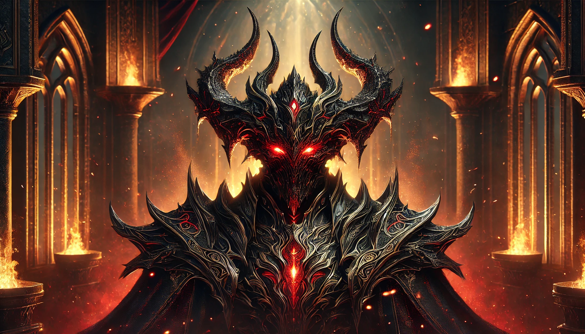
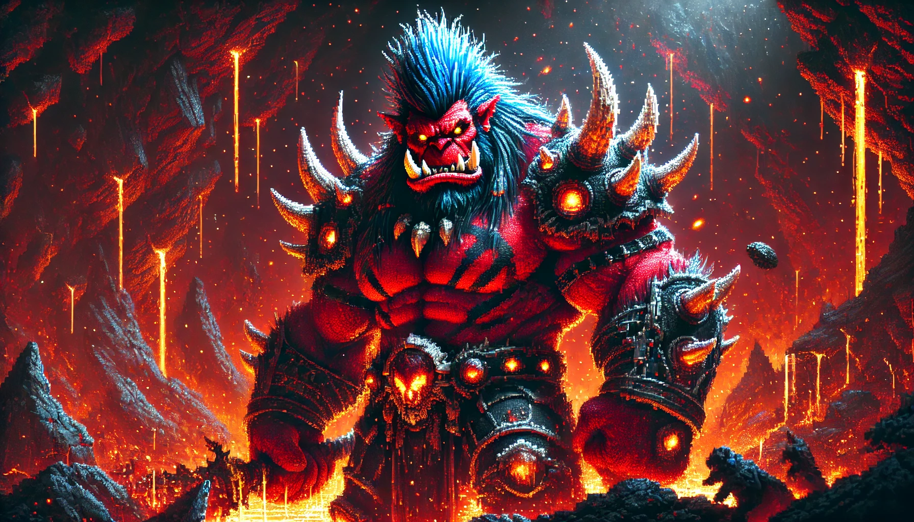

  

  

# RobotVRM

低コストで作成できる **人々と暮らす** LLMロボット(スマホロボット)を発展させるプロジェクト

- 本リポジトリはフォークを推奨しています。各々が独自のロボットを発展させてください
- 本リポジトリやソフトウェアを利用する場合は「RobotVRM」を使っていることを明示してください(詳細は[ライセンス](./LICENSE)参照)
- 本リポジトリのソフトウェアを利用して直接的にあらゆる人に危害や傷害を与えることを禁止しています(詳細は[ライセンス](./LICENSE)参照)

## ランニングコスト

Toolが使用できるマルチモーダルのLLMが必要。

動画のClaude 3 HaikuでのAPI料金は1時間辺り「5米ドル以内」

- 音声合成はホームサーバー使用で無料

### 検証環境

RobotVRM初号機ミナ(2024/11/19時点)

## 簡易お試し用(iOS、Android)

環境構築が手間の場合、ストアより有料のアプリですがダウンロードできます

- サーバー維持費のためにわずかに有料です(別途LLMのAPIが必要)
- Geminiはストア版ではサポートしていません。OSSの方をご利用ください。

### iOS

【FIXME、iOSのストアのリンク】

### Android

【FIXME、iOSのストアのリンク】

## コミュニティ

[**わいわいRobotVRM**(Discord)](https://discord.gg/UUUxwk6Xjf)というコミュニティがあるので気軽にご参加ください。リポジトリをフォークする方でも参加して頂いて大丈夫です(むしろそちらがメイン)。みんなで情報交換をしましょう。

## ベース

RobotVRMはオープンソースの、**pixiv**の[**pixiv/ChatVRM**](https://github.com/pixiv/ChatVRM)をベースにした[**ニケちゃん**](https://x.com/tegnike)の[**tegnike/aituber-kit** (MITライセンスの頃、2024/9/25以前)](https://github.com/tegnike/aituber-kit/tree/5c1be3dae7e38871839f37857e550b8f7387f718)をベースにして作成されています

## アプリの開発環境構築

[RobotVRMアプリの開発環境構築仕方](./docs/development.md)を参照

## ロボットの作り方

[ロボットの作り方](./docs/make_robot.md)を参照

## 設計

1. 定期的にカメラのキャプチャを撮影しキューに保持していく(キューには最大数があり、古いのが削除されていく)
2. "話す"、"感情を表す"、"移動する"のToolを指定して、定期的に保持しているキャプチャとシステムプロンプトでLLMにリクエスト
3. LLMのレスポンスのToolの呼び出しに応じてロボットを動かす

## GitHubの「robotvrm」トピック

将来的に **RobotVRMの一覧** の作成を行うと思っています。その際にGitHubの" **robotvrm** "のトピックで探そうと思うので、フォークした方は是非リポジトリの右上の"About"のところのTopicsに" **robotvrm** "のトピックを設定しておいてください

## 本リポジトリのキャラクター利用規約

本リポジトリのキャラクターは基本的には **無料で個人・法人共に商用利用可能** です(詳細は[**本リポジトリのキャラクター利用規約**](./CHARACTOR_LICENSE.md)参照)

<h2 align="center">
<a href="https://github.com/sponsors/saten-private">スポンサー</a>
</h2>

(額の大きいスポンサーのアイコン程大きくなります)

<h3 align="center">
  <a href="https://github.com/sponsors/saten-private">ドラゴンスポンサー US$1万2千(最大)</a>
</h3>

<!-- dragon -->このレベルのスポンサーは現在いません<!-- dragon -->

<h3 align="center">
 <a href="https://github.com/sponsors/saten-private">勇者スポンサー US$1万</a>
</h3>

<!-- hero -->このレベルのスポンサーは現在いません<!-- hero -->

<h3 align="center">
 <a href="https://github.com/sponsors/saten-private">魔王スポンサー US$5,000</a>
</h3>

<!-- devilking -->このレベルのスポンサーは現在いません<!-- devilking -->

<h3 align="center">
 <a href="https://github.com/sponsors/saten-private">エルフスポンサー US$1,000</a>
</h3>

<!-- elf -->このレベルのスポンサーは現在いません<!-- elf -->

<h3 align="center">
 <a href="https://github.com/sponsors/saten-private">デーモンスポンサー US$500</a>
</h3>

<!-- demon -->このレベルのスポンサーは現在いません<!-- demon -->

<h3 align="center">
 <a href="https://github.com/sponsors/saten-private">魔法使いスポンサー US$100</a>
</h3>

<!-- wizard -->このレベルのスポンサーは現在いません<!-- wizard -->

<h3 align="center">
 <a href="https://github.com/sponsors/saten-private">オーガスポンサー US$50</a>
</h3>

<!-- auger -->このレベルのスポンサーは現在いません<!-- auger -->

<h3 align="center">
 <a href="https://github.com/sponsors/saten-private">戦士スポンサー US$10</a>
</h3>

<!-- warrior -->このレベルのスポンサーは現在いません<!-- warrior -->

<h3 align="center">
 <a href="https://github.com/sponsors/saten-private">ウルフスポンサー US$5</a>
</h3>

<!-- wolf --><!-- wolf -->

<h3 align="center">
 <a href="https://github.com/sponsors/saten-private">スライムスポンサー US$1</a>
</h3>

<!-- slime -->このレベルのスポンサーは現在いません<!-- slime -->

