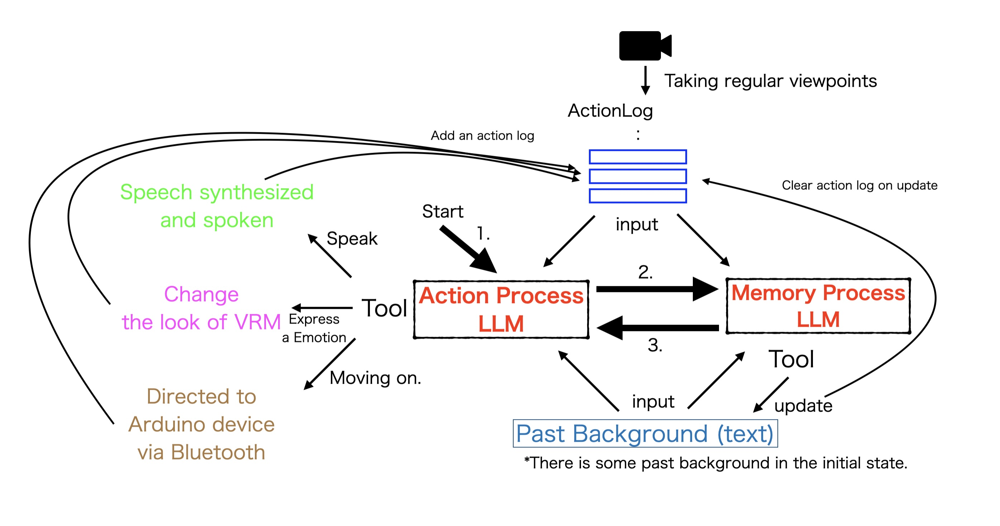

  

  

# RobotVRM

Project to develop LLM robots (smart phone robots) that can be created at low cost **live with people** .

- This repository encourages forking. Each person is encouraged to develop his/her own robot.
- When using this repository or software, please indicate that you are using **“RobotVRM”** (see [LICENSE](./LICENSE])
- Using the software in this repository to directly harm or injure any person is prohibited (for details, see [LICENSE](./LICENSE).

## Running cost

Need a multimodal LLM that can use Tool.

API rates at Claude 3 Haiku for videos are **“no more than US$5”** per hour.

- Speech synthesis is free with home server use

### Verification environment

RobotVRM First Model Mina (as of 11/19/2024)

## For simple trial (iOS, Android)

If you have trouble setting up an environment, you can download the application from the store for a fee.

- a paid app due to maintaining. (API required separately)
- Gemini is not supported in the store version; please use the OSS version.

### [iOS app](https://apps.apple.com/app/id6737445996)

### [Android app](https://play.google.com/store/apps/details?id=com.robotvrm.first)

## Community

We have a community called [**RobotVRM Community**(Discord)](https://discord.gg/UUUxwk6Xjf), so feel free to join. Even those who fork repositories are welcome to join (rather, that is the main focus). Let's exchange information together.

## ベース

RobotVRM is built on the open source, [**tegnike/aituber-kit** (around the time of the MIT license, before 2024/9/25)](https://github.com/tegnike/aituber-kit/tree/5c1be3dae7e38871839f37857e550b8f7387f718) by [**Nike-chan**](https://x.com/tegnike) based on [**pixiv**]'s [**pixiv/ChatVRM**](https://github.com/pixiv/ChatVRM).

## Building an application development environment

See [Building an App Development Environment](./docs/development.md)

## How to build a robot

See [How to Build a Robot](./docs/make_robot.md)

## Design

1. periodically take camera captures and keep them in a queue (there is a maximum number in the queue and the oldest ones are deleted)
2. request LLM with periodically kept captures and system prompts, specifying Tools for “speak”, “show emotion”, and “move”. 3.
3. move the robot in response to Tool calls in the LLM response

## The “robotvrm” topic on GitHub

In the future, we will create a **list of RobotVRMs**. If you have forked it, please set “ **robotvrm** ” as a topic in the “About” section in the upper right corner of the repository.

## Character Terms of Use for this Repository

The characters in this repository are basically **free of charge and can be used for commercial purposes by both individuals and corporations** (for details, please refer to the [**Terms of Use of Characters in this Repository**](./CHARACTOR_LICENSE.md) for details)

<h2 align="center">
<a href="https://github.com/sponsors/saten-private">Sponsor</a>
</h2>

(The larger the sponsor's icon, the larger the amount)

<h3 align="center">
  <a href="https://github.com/sponsors/saten-private">Dragon Sponsor US$12,000 (maximum)</a>
</h3>

<!-- dragon -->There are currently no sponsors at this level.<!-- dragon -->

<h3 align="center">
 <a href="https://github.com/sponsors/saten-private">Hero Sponsor US$10,000</a>
</h3>

<!-- hero -->There are currently no sponsors at this level.<!-- hero -->

<h3 align="center">
 <a href="https://github.com/sponsors/saten-private">Demon King Sponsor US$5,000</a>
</h3>

<!-- devilking -->There are currently no sponsors at this level.<!-- devilking -->

<h3 align="center">
 <a href="https://github.com/sponsors/saten-private">Elf Sponsor US$1,000</a>
</h3>

<!-- elf -->There are currently no sponsors at this level.<!-- elf -->

<h3 align="center">
 <a href="https://github.com/sponsors/saten-private">Demon Sponsor US$500</a>
</h3>

<!-- demon -->There are currently no sponsors at this level.<!-- demon -->

<h3 align="center">
 <a href="https://github.com/sponsors/saten-private">Wizard Sponsor US$100</a>
</h3>

<!-- wizard -->There are currently no sponsors at this level.<!-- wizard -->

<h3 align="center">
 <a href="https://github.com/sponsors/saten-private">Auger Sponsor US$50</a>
</h3>

<!-- auger -->There are currently no sponsors at this level.<!-- auger -->

<h3 align="center">
 <a href="https://github.com/sponsors/saten-private">Warrior Sponsor US$10</a>
</h3>

<!-- warrior -->There are currently no sponsors at this level.<!-- warrior -->

<h3 align="center">
 <a href="https://github.com/sponsors/saten-private">Wolf Sponsor US$5</a>
</h3>

<!-- wolf -->There are currently no sponsors at this level.<!-- wolf -->

<h3 align="center">
 <a href="https://github.com/sponsors/saten-private">Slime Sponsor US$1</a>
</h3>

<!-- slime --><!-- slime -->

