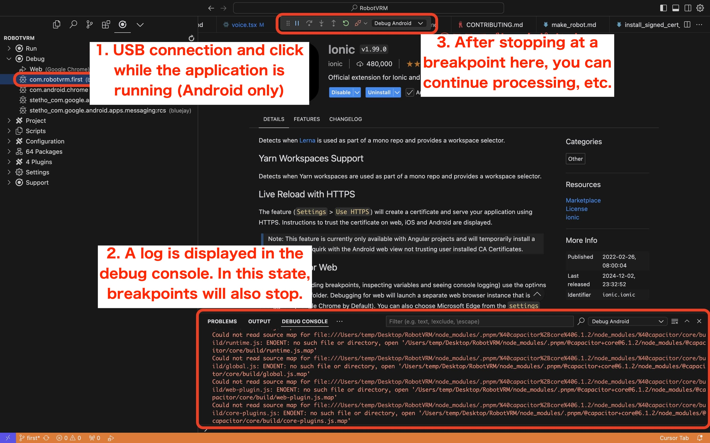

# RobotVRMアプリの開発環境構築仕方

## 必要なもの

- Android又はiOSのスマホ(iOSはIonicのExtensionでデバッグができないので **Android推奨**)
  - 必要な最小OS
    - Androidは[こちら](../android/variables.gradle#L2)の`minSdkVersion`を参照
    - iOSは[こちら](../ios/App/App.xcodeproj/project.pbxproj)の`IPHONEOS_DEPLOYMENT_TARGET`参照
- 管理者権限のあるPC(サーバーとしても使います)
  - iOSアプリを開発する場合macOSが必要です
  - 一応下記環境で検証してあります
    - macOS(Appleシリコン、macOS Sonoma)
    - Windows(Windows 11 Home)
  - 検証はしていないですがLinuxなどでも恐らく動かすことは可能
- 家庭内LAN(開発環境構築のため)

## 家庭内LAN上にサーバーを立てる

RobotVRMの開発環境を構築するためのサーバーを家庭内LAN上に立てます(普段使用しているPCなどで大丈夫です)

### IPアドレス(IPv4)を固定

家庭内LAN上でIPアドレスを固定します。DHCPの自動割当てのIPアドレスとバッティングし辛いようにIPアドレス(IPv4)の最後の番号は高めに設定しておくと良いかもしれません(例:192.168.X.199)

設定方法を下記を参照しました。

[macOS - MacでDHCPまたは手動IPアドレスを使用する](https://support.apple.com/ja-jp/guide/mac-help/mchlp2718/mac)

[Windows - Windows 11のIPアドレス（IPv4）を固定に設定する手順](https://www.aterm.jp/support/qa/qa_external/00244/win11.html)

### エディタ(ターミナル)のインストール

作者は現状は[Cursorエディタ](https://www.cursor.com/)を使用しています(ProプランでClaude 3.5 Sonnetを使ってガシガシ開発しています)

※ VSCodeエディタでも開発はできると思います

### RobotVRMのリポジトリをクローン

1. RobotVRMのリポジトリをCloneします(git cloneなどで)
1. カレントディレクトリをRobotVRMのリポジトリに移動します
   ```
   cd RobotVRM
   ```

### .env.local準備

1. 以下を実行して`.env`ファイルから`.env.local`を作成します
   ```
   cp .env .env.local
   ```
1. `.env.local`の以下の値を設定します
   - `ROBOTVRM_DEVELOPMENT_HOST`に固定したIPアドレス("X.X.X.X")を入力します
   - `NEXT_PUBLIC_ROBOTVRM_DOCS_URL`にアプリがGitHub上のドキュメントを参照するために、CloneしたリポジトリのGitHubのブランチのURLを入力します。このURLをルートとしてドキュメントを参照します
     - saten-privateがオーナーの場合の例) "https://github.com/saten-private/RobotVRM/tree/main"
     - リポジトリが非公開の場合はドキュメントとして参照している部分のみ公開しているリポジトリを別途用意するか、同様の参照しているパスに対してドキュメントを作成すれば良いと思います
     - アプリ内から説明を参照するドキュメントのリンク部分に過ぎないので、設定しなくてもアプリの動作は可能です

### nodeの環境を準備

1. [nodeのセットアップ仕方](./setup_node.md)の手順を実施
1. (macOSの場合)利用しているシェルに応じて読み込みます。ターミナルのコマンドを入力するところの前に`%`が表示されている場合はzsh、`$`が表示される場合はbashです。
   - zsh
     ```
     source ~/.zshrc
     ```
   - bash
     ```
     source ~/.bashrc
     ```
1. 以下で[こちらのnodeバージョン](../.node-version)であることを確認(RobotVRMをカレントディレクトリで実行してください)
   ```
   node -v
   ```

### Gemの設定(macOSのみ)

1. 利用しているシェルに応じて次の1行を追記します。ターミナルのコマンドを入力するところの前に`%`が表示されている場合はzshなので`~/.zshrc`、`$`が表示される場合はbashなので`~/.bashrc`に追記してください、ファイルが無い場合は作成してください。以下はVimでの例
   1. ファイルを開く、ファイルが無い場合空ファイルとして開きます。(Vimの使い方は[こちら](https://zenn.dev/masatotezuka/articles/vim_command_220225)参照)
      - zsh
        ```
        vim ~/.zshrc
        ```
      - bash
        ```
        vim ~/.bashrc
        ```
   1. 開いたVimエディタの最下部にカーソルを移動し`i`のキーを押すと入力モードになります
   1. 下記を追記
      ```
      export GEM_HOME="$HOME/.gem"
      ```
   1. `esc`のキーを押して入力モードを終了
   1. `:wq`を入力してエンターを押すことで内容を保存し、元のターミナルに戻ります
1. 以下を実行して上記ファイルを読み込みます
   - zsh
     ```
     source ~/.zshrc
     ```
   - bash
     ```
     source ~/.bashrc
     ```

### pnpmのインストール

1. [packege.json](../package.json)のpnpmのバージョンをインストール
   ```
   npm install -g pnpm@(package.jsonに記載されているpnpmのバージョン)
   ```
1. (macOSの場合)利用しているシェルに応じて読み込みます。ターミナルのコマンドを入力するところの前に`%`が表示されている場合はzsh、`$`が表示される場合はbashです。
   - zsh
     ```
     source ~/.zshrc
     ```
   - bash
     ```
     source ~/.bashrc
     ```

### RobotVRMのセットアップ

1. (Windowsの場合)ターミナルを起動してからプロセスに権限を与えていない場合pnpmを実行する前に与えてください([参照](https://qiita.com/ponsuke0531/items/4629626a3e84bcd9398f))。pnpmを実行する場合は、ターミナルを起動する度に実行してください。
   ```
   Set-ExecutionPolicy -ExecutionPolicy RemoteSigned -Scope Process
   ```
1. 依存関係インストール
   ```
   pnpm install
   ```

### オレオレ証明書の作成

※ SSLの環境で開発しないと本番環境との齟齬が生じやすいためSSLの環境で開発をします

[オレオレ証明書の作成](./create_self_signed_cert_ssl.md)の手順で固定したIPアドレスの証明書を作成し、作成された証明書を`localhost+2-key.pem`と`localhost+2.pem`という名前でRobotVRMの`certificates`フォルダ配下に置いてください

### 初期ビルド(一度のみ基本的には実行すればOKのはず)

- macOSの場合
  1. 以下を実行しRobotVRMサーバーのビルドを一通り通します ※管理者権限必要
  ```
  sudo pnpm start
  ```
  1. ビルドが終わってサーバーが起動したら`Ctrl+C`で終了します
- Windowsの場合
  1. 管理者権限でターミナルを起動
     - Cursorエディタのターミナルを使用している場合はCursorエディタを管理者権限で起動すれば良いです
  1. ターミナルを起動してからプロセスに権限を与えていない場合pnpmを実行する前に与えてください([参照](https://qiita.com/ponsuke0531/items/4629626a3e84bcd9398f))。pnpmを実行する場合は、ターミナルを起動する度に実行してください。
     ```
     Set-ExecutionPolicy -ExecutionPolicy RemoteSigned -Scope Process
     ```
  1. 以下を実行しRobotVRMサーバーのビルドを一通り通します ※管理者権限必要
     ```
     pnpm start
     ```
  1. ビルドが終わってサーバーが起動したら`Ctrl+C`で終了します

### 開発環境サーバーを立ち上げる

#### macOS

以下を実行しRobotVRMサーバーを立てます ※管理者権限必要

```
sudo pnpm dev
```

ストアと同じので実行したい場合は下記を実行(ストア版はサーバーの負担を割くため、機能削減しています)

```
sudo pnpm dev-store
```

#### Windows

1. 管理者権限でターミナルを起動
   - Cursorエディタのターミナルを使用している場合はCursorエディタを管理者権限で起動すれば良いです
1. 以下を実行しRobotVRMサーバーを立てます ※管理者権限必要
   ```
   pnpm dev
   ```
   ストアと同じので実行したい場合は下記を実行(ストア版はサーバーの負担を割くため、機能削減しています)
   ```
   pnpm dev-store
   ```
1. サーバー起動中は1つのターミナルを占有するため、サーバーを立ち上げつつ他の作業をする場合はもう1つターミナルと起動してください
   - Cursorエディタの場合はターミナルの右上に画面分割のアイコンを押して、画面を分割した状態でもう一つターミナルを起動すると作業しやすいです

## オレオレ証明書をスマホへインストールする

[オレオレ証明書のスマホへのインストール仕方](./install_signed_cert_ssl_to_smartphone.md)を参照

## RobotVRMアプリのビルド・インストール

### Android

#### Android Studioをインストール・セットアップ

[Android Studio](https://developer.android.com/studio?hl=ja)をインストールして起動し、セットアップします。standardの設定で大丈夫です

#### JAVA_HOMEのパスを通す

##### macOSの場合

1. 利用しているシェルに応じて次の1行を追記します。ターミナルのコマンドを入力するところの前に`%`が表示されている場合はzshなので`~/.zshrc`、`$`が表示される場合はbashなので`~/.bashrc`に追記してください、ファイルが無い場合は作成してください。以下はVimでの例
   1. ファイルを開く、ファイルが無い場合空ファイルとして開きます。(Vimの使い方は[こちら](https://zenn.dev/masatotezuka/articles/vim_command_220225)参照)
      - zsh
        ```
        vim ~/.zshrc
        ```
      - bash
        ```
        vim ~/.bashrc
        ```
   1. 開いたVimエディタの最下部にカーソルを移動し`i`のキーを押すと入力モードになります
   1. 下記を追記
      ```
      export JAVA_HOME="/Applications/Android Studio.app/Contents/jbr/Contents/Home"
      ```
   1. `esc`のキーを押して入力モードを終了
   1. `:wq`を入力してエンターを押すことで内容を保存し、元のターミナルに戻ります
1. 以下を実行して上記ファイルを読み込みます
   - zsh
     ```
     source ~/.zshrc
     ```
   - bash
     ```
     source ~/.bashrc
     ```

##### Windowsの場合

[Buzzword Inc.](http://www.buzzword.co.jp/)さんの[PATHの設定及び環境変数JAVA_HOMEの設定](https://www.javadrive.jp/start/install/index4.html)を参考にJAVA_HOMEの環境変数を設定させて頂きました。

1. [Buzzword Inc.](http://www.buzzword.co.jp/)さんの[PATHの設定及び環境変数JAVA_HOMEの設定](https://www.javadrive.jp/start/install/index4.html)の手順で下記のようにAndroid Studio内のjbrのパスを`JAVA_HOME`の環境変数として設定します。(システム環境変数でなくユーザー環境変数でも良いです)
   ```
   C:\Program Files\Android\Android Studio\jbr
   ```
1. 反映するためにターミナルを再起動する


#### プロジェクトを開く

1. 以下を実行することでAndroidプロジェクトを開くことができます
   ```
   npx cap open android
   ```
1. 信頼するかのポップアップが表示された場合は、"Trust Project"を選択してください

#### Androidデバイスで開発者向けオプション設定

[デバイスの開発者向けオプションを設定する](https://developer.android.com/studio/debug/dev-options?hl=ja)の手順でUSBデバッグを有効にするところまで実施

#### Androidアプリのビルド・インストール

1. 開発者向けオプション設定したAndroidデバイスをUSBでPCに接続
1. (Windowsの場合)ターミナルを起動してからプロセスに権限を与えていない場合pnpmを実行する前に与えてください([参照](https://qiita.com/ponsuke0531/items/4629626a3e84bcd9398f))。pnpmを実行する場合は、ターミナルを起動する度に実行してください。
   ```
   Set-ExecutionPolicy -ExecutionPolicy RemoteSigned -Scope Process
   ```
1. 以下を実行
   ```
   pnpm android
   ```
1. 認識されているAndroidデバイスを選択してビルド・インストール
1. RobotVRMのアプリの画面が表示されればOKです

### iOS(macOSのみ)

#### Xcodeインストール

[Xcode](https://apps.apple.com/jp/app/xcode/id497799835?mt=12)をインストール

#### rubyの環境を準備

1. [rubyのセットアップ仕方](./setup_ruby.md)の手順を実施
1. (macOSの場合)利用しているシェルに応じて読み込みます。ターミナルのコマンドを入力するところの前に`%`が表示されている場合はzsh、`$`が表示される場合はbashです。
   - zsh
     ```
     source ~/.zshrc
     ```
   - bash
     ```
     source ~/.bashrc
     ```
1. 以下で[こちらのrubyバージョン](../.ruby-version)であることを確認(RobotVRMをカレントディレクトリで実行してください)
   ```
   ruby -v
   ```

#### bundlerのインストール

1. 以下を実行しbunderをインストール
   ```
   gem install bundler -v "2.5.23"
   ```
1. 以下でインストールしたバージョンのbundlerであることを確認
   ```
   bundler -v
   ```

#### Gemfileの依存関係をインストール

以下を実行しGemfileの依存関係をインストール

```
bundle install
```

#### プロジェクトを開く

下記を実行してXcodeプロジェクトを開く

```
npx cap open ios
```

#### Apple IDでサインイン

Xcode > Settings > Accounts > 左下の"+"キーを押下 > "Apple ID"を選択して"Continue"押下し、Apple IDでサインインする

#### Team IDの設定

1. Xcodeの左のところからプロジェクト("App")を選択します
1. 開いたプロジェクトのタブの中で"Signing & Capabilities"を選択します
1. Teamのプルダウンから自分の使用したいTeamを選択します。ひとまずApple Developer Programに登録せずビルドをしたい場合は、Personal Teamのを選択してください
1. Team IDの公開されるのはあまり良い方では無いので`.env.local`に記載を移します
   1. 以下を実行して設定されたTeam ID(`DEVELOPMENT_TEAM`)の文字列を確認します(末尾の;は除いてください)
      ```
      git diff
      ```
   1. その文字列を`.env.local`の`ROBOTVRM_IOS_DEVELOPMENT_TEAM`にその文字列を設定します
   1. Team IDがコミットされないように差分を消します
      ```
      git stash
      ```

#### Bundle Identifierの変更

プロジェクトのBundle Identifierは既にリポジトリ管理者が使用しているので、Bundle Identifierを自分のオリジナルものにします。

1. Xcodeの左のところからプロジェクト("App")を選択します
1. 開いたプロジェクトのタブの中で"Signing & Capabilities"を選択します
1. "Bundle Identifier"をこちらのようなイメージ(com.(ユーザー名).(アプリ名))で任意のものに変更します。

#### iOSデバイスでデベロッパモードを有効にする

設定アプリ > プライバシーとセキュリティ > "デベロッパモード"をON にする

#### iOSデバイスの認識

1. 以下を実行しXcodeプロジェクトを同期させます
   ```
   pnpm sync
   ```
1. Xcodeを開いた状態でiOSデバイスをPCに接続し認識させます
1. Xcodeで対象のiOSデバイスを選択してCommand+Rのキーを押せば実機ビルド・インストールしようとする。その際、デバイスの登録を確認されるのでデバイスを登録する
1. codesignのポップアップが表示された場合はMacのパスワードを入力して"常に許可"を選択してください
1. 以下ポップアップが表示される場合は以下手順に従ってiOSデバイス上で信頼状態にしてください
   1. 設定アプリ > 一般 > VPNとデバイス管理 > "Apple Development: XXXXX"を選択し詳細に遷移 > "Apple Development: XXXXX"を押下すると信頼する旨のポップアップが表示されるので"信頼"を押下
   1. 再度XcodeでCommand+Rで実機ビルド・インストール

#### iOSアプリのビルド・インストール

以後は以下を実行することでターミナル上(Cursorエディタなど)からiOSアプリをビルド・インストールできます。

1. 開発向けに設定したiOSデバイスをUSBでPCに接続
1. 以下を実行
   ```
   pnpm ios
   ```
1. 認識されているAndroidデバイスを選択してビルド・インストール
1. RobotVRMのアプリの画面が表示されればOKです

## デバッグ方法(Androidのみ)

### IonicのExtensionのインストール

[Ionic](https://marketplace.visualstudio.com/items?itemName=ionic.ionic)のCursorエディタ(又はVSCodeエディタ)にインストールしてください

### デバッグ手順

1. [デバイスの開発者向けオプションを設定](https://developer.android.com/studio/debug/dev-options?hl=ja)してあるAndroidデバイスで開発環境でインストールしたRobotVRMアプリを起動している状態にします
1. 下記キャプチャのようにIonicのExtensionの Debug > (RobotVRMアプリのアプリケーションID) を選択するとデバッグコンソールでログが表示されるようになります。この状態でブレークポイントを設定して止めることもできます。
    - 作者はデバッグでIonicのExtensionを頻繁に使うので、下記キャプチャのようにピン留めしておくことで常にタブの前の方に表示しています
   

## ドキュメント編集方法(Markdown)

ドキュメント(Markdown)を編集することもあると思いますので一応楽な編集方法も記載しておきます

1. Cursorエディタでドキュメント(\*.md)を開く
1. 下記キャプチャのようにMarkdownのプレビューを表示する
    - プレビューのボタンが表示されない場合は[Markdown Preview Enhanced](https://marketplace.visualstudio.com/items?itemName=shd101wyy.markdown-preview-enhanced)をインストールすると良いかもしれません
1. プレビュー見ながら編集する

## リリース仕方(整備中)

[リリース仕方(整備中、現状最低限の記載)](./release.md)を参照
