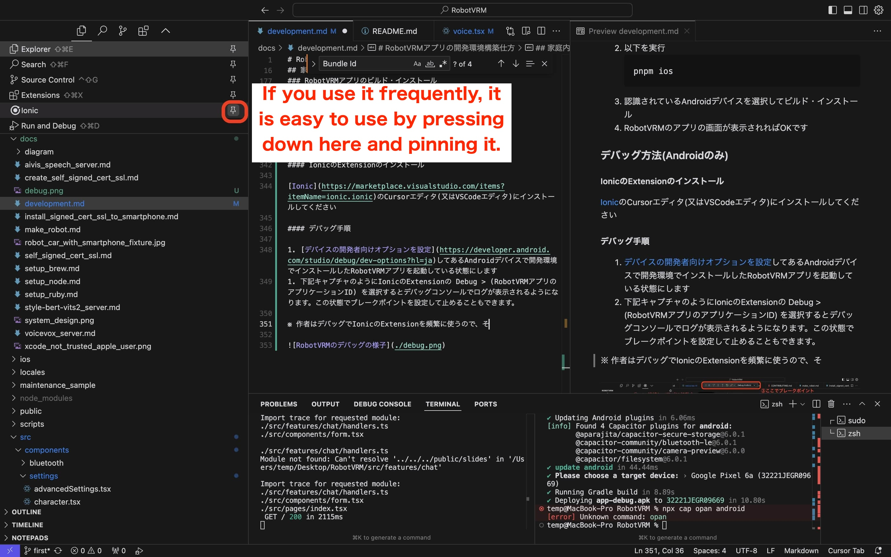

# How to build a development environment for RobotVRM applications

## What you need

- Android or iOS smartphone(iOS cannot be debugged with Ionic's Extension, so **Android recommended**)
  - Minimum OS required
    - Android is [here](../android/variables.gradle#L2) for `minSdkVersion`
    - iOS is [here]](../ios/App/App.xcodeproj/project.pbxproj) for `IPHONEOS_DEPLOYMENT_TARGET`
- PC with administrator rights(also used as a server)
  - macOS is required for iOS app development
  - The following environment has been verified
    - macOS (Apple Silicon, macOS Sonoma)
    - Windows(Windows 11 Home)
  - I haven't tested it, but it can probably be run on Linux, etc.
- Home LAN (for building development environment)

## Set up a server on the home LAN

Set up a server on your LAN to build a development environment for RobotVRM (you can use any PC you normally use).

### Fixed IP address (IPv4)

Fix an IP address on the home LAN; it may be a good idea to set the last number of the IP address (IPv4) to a higher value to avoid conflict with the IP address automatically assigned by DHCP (e.g., 192.168.X.199).

See below for instructions on how to set it up.

[Use DHCP or a manual IP address on Mac](https://support.apple.com/guide/mac-help/use-dhcp-or-a-manual-ip-address-on-mac-mchlp2718/mac)

[How to set static IP address in Windows](https://www.raceresult.com/en-us/support/kb?id=32296-How-to-set-static-IP-address-in-Windows)

### Installing the Editor (Terminal)

The author is currently using [Cursor editor](https://www.cursor.com/) (I'm developing heavily with Claude 3.5 Sonnet on the Pro plan).

* I believe development can be done with the VSCode editor.

### Clone RobotVRM repository

1. Clone the RobotVRM repository (e.g. git clone)
1. Change the current directory to the RobotVRM repository
   ```
   cd RobotVRM
   ```

### .env.local preparation

1. Copy `.env.local` from the `.env` file by running the following
   ```
   cp .env .env.local
   ```
1. Set the following values in `.env.local`
   - Enter a fixed IP address (“X.X.X.X”) in `ROBOTVRM_DEVELOPMENT_HOST`
   - In `NEXT_PUBLIC_ROBOTVRM_DOCS_URL`, enter the URL of the GitHub branch of the repository you cloned in order for the app to reference documents on GitHub. This URL will be used as the root to refer to the document
     - Example if saten-private is the owner) “https://github.com/saten-private/RobotVRM/tree/main”
     - If the repository is private, you can prepare a separate repository that only publishes the part of the document that refers to it as documentation, or you can create documentation for the same path that refers to it.
     - It is just a link part of the document that refers to the description from within the app, so the app can work without setting it!

### Prepare node environment

1. Follow the steps in [How to setup node](./setup_node.md)
1. (For macOS) Load according to the shell you are using. If you see `%` before where you enter the terminal command, it is zsh, and if you see `$`, it is bash.
   - zsh
     ```
     source ~/.zshrc
     ```
   - bash
     ```
     source ~/.bashrc
     ```
1. Below is the [node version here](../.node-version) (Run RobotVRM in the current directory)
   ```
   node -v
   ```

### Gem settings (macOS only)

1. Add the following line according to the shell you are using. If you see `%` in front of the terminal where you enter commands, it is zsh, so add it to `~/.zshrc`. If you see `$`, it is bash, so add it to `~/.bashrc`. Here is an example in Vim
   1. Open file, or open as a blank file if there is no file. (See [Getting started with Vim: The basics](https://opensource.com/article/19/3/getting-started-vim) for how to use Vim.)
      - zsh
        ```
        vim ~/.zshrc
        ```
      - bash
        ```
        vim ~/.bashrc
        ```
   1. Move the cursor to the bottom of the opened Vim editor and press the `i` key to enter the input mode
   1. Add the following
      ```
      export GEM_HOME="$HOME/.gem"
      ```
   1. Exit input mode by pressing the `esc` key.
   1. Type `:wq` and press enter to save the contents and return to the original terminal
1. Load the above file by executing the following
   - zsh
     ```
     source ~/.zshrc
     ```
   - bash
     ```
     source ~/.bashrc
     ```

### Installing pnpm

1. Install the version of pnpm in [packege.json](../package.json) pnpm version installed
   ```
   npm install -g pnpm@(The version of pnpm in package.json)
   ```
1. (For macOS) Load according to the shell you are using. If you see `%` before where you enter the terminal command, it is zsh, and if you see `$`, it is bash.
   - zsh
     ```
     source ~/.zshrc
     ```
   - bash
     ```
     source ~/.bashrc
     ```

### RobotVRM setup

1. (On Windows) If you have not given permission to the process after starting the terminal, do so before running pnpm ([see](https://stackoverflow.com/a/58458082)). If you run pnpm If you are going to run pnpm, run it every time you start the terminal.
   ```
   Set-ExecutionPolicy -ExecutionPolicy RemoteSigned -Scope Process
   ```
1. Dependency Installation
   ```
   pnpm audit-install
   ```

### Creation of Self-Signed Certificate

※ Develop in an SSL environment because it is easy to cause discrepancies with the production environment if not developed in an SSL environment.

Create a certificate for the IP address fixed in the procedure for [creating a self-signed certificate](./create_self_signed_cert_ssl.md), and place the created certificate under the `certificates` folder of RobotVRM with the names `localhost+2-key.pem` and `localhost+2.pem`.

### Set up a development environment server

#### macOS

Set up a RobotVRM server by executing the following *Administrative privileges required

```
sudo pnpm dev
```

If you want to run the same as the store version, do the following (the store version has reduced functionality to save server load)

```
sudo pnpm dev-store
```

#### Windows

1. Start the terminal with administrator privileges
   - If you are using the Cursor editor terminal, just start the Cursor editor with administrator privileges
1. Set up a RobotVRM server by executing the following *Administrative privileges required
   ```
   pnpm dev
   ```
   If you want to run the same as the store version, do the following (the store version has reduced functionality to save server load)
   ```
   pnpm dev-store
   ```
1. One terminal is occupied while the server is running, so if you want to work on other tasks while the server is running, please start another terminal and
   - For the Cursor editor, it is easier to work by pressing the split screen icon in the upper right corner of the terminal and launching another terminal with a split screen

## Install a self-signed certificate on your smartphone

See [how to install a self-signed certificate on your phone](./install_signed_cert_ssl_to_smartphone.md).

## Build and install RobotVRM application

### Android

#### (For macOS)Xcode installation

For macOS, please install and start [Xcode](https://apps.apple.com/us/app/xcode/id497799835?mt=12) and **agree to the license**, etc. as Xcode is required to build even for Android development.

#### Install and setup Android Studio

Install [Android Studio](https://developer.android.com/studio?hl=ja), launch it and set it up. The **standard** setting is fine.

#### Pass JAVA_HOME path

##### For macOS

1. Add the following line according to the shell you are using. If you see `%` in front of the terminal where you enter commands, it is zsh and you should add it to `~/.zshrc`, if you see `$`, it is bash and you should add it to `~/.bashrc`, if there is no file, create one. Here is an example in Vim
   1. Open file, or open as a blank file if there is no file. (See [Getting started with Vim: The basics](https://opensource.com/article/19/3/getting-started-vim) for how to use Vim.)
      - zsh
        ```
        vim ~/.zshrc
        ```
      - bash
        ```
        vim ~/.bashrc
        ```
   1. Move the cursor to the bottom of the opened Vim editor and press the `i` key to enter the input mode
   1. Add the following
      ```
      export JAVA_HOME="/Applications/Android Studio.app/Contents/jbr/Contents/Home"
      ```
   1. Exit input mode by pressing the `esc` key.
   1. Type `:wq` and press enter to save the contents and return to the original terminal
1. Load the above file by executing the following
   - zsh
     ```
     source ~/.zshrc
     ```
   - bash
     ```
     source ~/.bashrc
     ```

##### For Windows

I set the environment variable of `JAVA_HOME` by referring to [How to Set Up the JAVA_HOME Variable on Windows 11](https://www.makeuseof.com/java-home-variable-windows-11/) by [aman-kumar](https://www.makeuseof.com/author/aman-kumar/).

1. Set the path of jbr in Android Studio as the environment variable `JAVA_HOME` as shown below in the procedure [How to Set Up the JAVA_HOME Variable on Windows 11](https://www.makeuseof.com/java-home-variable-windows-11/) by [aman-kumar](https://www.makeuseof.com/author/aman-kumar/). (It can be a user environment variable instead of a system environment variable.)
   ```
   C:\Program Files\Android\Android Studio\jbr
   ```
1. Restart the terminal to reflect

#### Open Project

1. You can open an Android project by doing the following
   ```
   npx cap open android
   ```
1. If a Trust pop-up appears, select “Trust Project”.

#### Set Developer options on Android devices

Follow the steps in [Set Developer options for the device](https://developer.android.com/studio/debug/dev-options) to the point where USB debugging is enabled.

#### Build and install Android apps

- For macOS
  1.  Android device configured with Developer options connected to PC via USB
  1.  (You only need to run it **once** just before to create the `webDir`) Run the following to go through the RobotVRM server build *Administrator privileges required
      ```
      sudo pnpm build
      ```
  1.  Perform the following
      ```
      pnpm android
      ```
  1.  Select a recognized Android device to build and install
  1.  If the RobotVRM app screen appears, you are good to go!
- For Windows
  1.  Android device configured with Developer options connected to PC via USB
  1.  Start the terminal with administrator privileges
      - If you are using the Cursor editor terminal, just start the Cursor editor with administrator privileges
  1.  If you have not given permission to the process after starting the terminal, do so before running pnpm ([see](https://stackoverflow.com/a/58458082)). If you run pnpm If you are going to run pnpm, run it every time you start the terminal.
      ```
      Set-ExecutionPolicy -ExecutionPolicy RemoteSigned -Scope Process
      ```
  1.  (You only need to run it **once** just before to create the `webDir`) Run the following to go through the RobotVRM server build *Administrator privileges required
      ```
      pnpm build
      ```
  1.  Perform the following
      ```
      pnpm android
      ```
  1.  Select a recognized Android device to build and install
  1.  If the RobotVRM app screen appears, you are good to go!

### iOS (macOS only)

#### Xcode installation

Install [Xcode](https://apps.apple.com/us/app/xcode/id497799835?mt=12)

#### Prepare ruby environment

1. Follow the instructions in [How to setup ruby](./setup_ruby.md)
1. Load according to the shell you are using. If you see `%` in front of where you enter commands in the terminal, it is zsh, and if you see `$`, it is bash.
   - zsh
     ```
     source ~/.zshrc
     ```
   - bash
     ```
     source ~/.bashrc
     ```
1. Check the following for [ruby version here](../.ruby-version) (Run RobotVRM in the current directory)
   ```
   ruby -v
   ```

#### Installing CocoaPods

* If I manage with bundler, it asked me to install bundler even though ruby is not required to build Android on Windows, so I install CocoaPods directly.

1. Run the following to install CocoaPods
   ```
   gem install cocoapods -v "1.16.2"
   ```
1. Load according to the shell you are using. If you see `%` in front of where you enter commands in the terminal, it is zsh, and if you see `$`, it is bash.
   - zsh
     ```
     source ~/.zshrc
     ```
   - bash
     ```
     source ~/.bashrc
     ```
1. Verify that you are using the version of CocoaPods installed below
   ```
   pod --version
   ```

#### Open Project

Open the Xcode project by executing the following

```
npx cap open ios
```

#### Sign in with your Apple ID

Xcode > Settings > Accounts > Press the “+” key in the lower left corner > Select “Apple ID” and press “Continue” to sign in with your Apple ID.

#### Team ID Settings

1. Select the project (“App”) from the left part of Xcode
1. Select “Signing & Capabilities” in the tabs of the opened project
1. Select the team you want to use from the Team pull-down menu. If you want to build without enrolling in the Apple Developer Program, select Personal Team.
1. Team ID's are not very good to be made public, so we move the description to `.env.local`.
   1. Run the following to see the Team ID (`DEVELOPMENT_TEAM`) string that has been set (without the trailing ;)
      ```
      git diff
      ```
   1. Set that string to `ROBOTVRM_IOS_DEVELOPMENT_TEAM` in `.env.local`
   1. Erase the diff so that the Team ID is not committed
      ```
      git stash
      ```

#### Change Bundle Identifier

Since the Bundle Identifier of the project is already used by the repository manager, make the Bundle Identifier your original one.

1. Select the project (“App”) from the left part of Xcode
1. Select the project (“App”) from the left part of Xcode and select “Signing & Capabilities” in the tab of the opened project.
1. Change the “Bundle Identifier” to something like this (com.(username). (app name)) to something arbitrary.

#### Enable Developer Mode on iOS devices

Setting App > Privacy & Security > Turn on “Developer Mode“

#### iOS device recognition

1. Open the Xcode project by doing the following
   ```
   npx cap open ios
   ```
1. With Xcode open, connect the iOS device to the PC for recognition.
1. Select the target iOS device in Xcode and press Command+R to build and install the actual device. At that time, you will be asked to register the device.
1. When the codesign popup appears, enter your Mac password and select “Always allow”.
1. If you see the pop-up below, please follow the steps below to put the device into a trusted state on your iOS device
   1. Setting App > General > VPN & Device Management > Select “Apple Development: XXXXX” and go to details > Click “Apple Development: XXXXX” to display a pop-up asking you to trust, then click “Trust”.
   1. Command+R in Xcode again to build and install the actual device

#### Build and install iOS apps

Thereafter, you can build and install iOS apps from the terminal (e.g. Cursor editor) by executing the following

1. Connect an iOS device configured for development to a PC via USB
1. (You only need to run it **once** just before to create the `webDir`) Run the following to go through the RobotVRM server build *Administrator privileges required
   ```
   sudo pnpm build
   ```
1. Perform the following
   ```
   pnpm ios
   ```
1. Select a recognized Android device to build and install
1. If the RobotVRM app screen appears, you are good to go!

## Restore IP address (IPv4)

When accessing different networks, please restore the fixed IP address settings below, as we believe that fixed IP addresses will have a negative impact.

[Use DHCP or a manual IP address on Mac](https://support.apple.com/guide/mac-help/use-dhcp-or-a-manual-ip-address-on-mac-mchlp2718/mac)

[How to set static IP address in Windows](https://www.raceresult.com/en-us/support/kb?id=32296-How-to-set-static-IP-address-in-Windows)

## Debugging method (Android only)

### Installing Ionic Extension

Install [Ionic's Extension](https://marketplace.visualstudio.com/items?itemName=ionic.ionic) into the Cursor editor (or VSCode editor).

### Debugging procedure

1. Connect the Android device that has the [Set device Developer options](https://developer.android.com/studio/debug/dev-options) via USB to the RobotVRM application installed in the development environment and start the application.
1. Select Debug > (Application ID of RobotVRM app) in Ionic's Extension as shown in the capture below to see the log in the debug console. You can also set a breakpoint in this state to stop it.
   
   The author uses Ionic's Extension frequently for debugging, so it is pinned and dragged and dropped at the top as shown in the capture below, so that it is always displayed at the front of the tab for ease of use.
   

## Document Editing Methods (Markdown)

We also provide an easy way to edit documents (Markdown).

1. Open the document (\*.md) in the Cursor editor
1. Display a preview of Markdown as shown in the following capture.
   
   If you do not see the preview button, you may want to install [Markdown Preview Enhanced](https://marketplace.visualstudio.com/items?itemName=shd101wyy.markdown-preview-enhanced) may be a good idea.
1. Edit while watching the preview

## How to release (under maintenance)

See [how to release (under maintenance, minimal description of current status)](./release.md)
