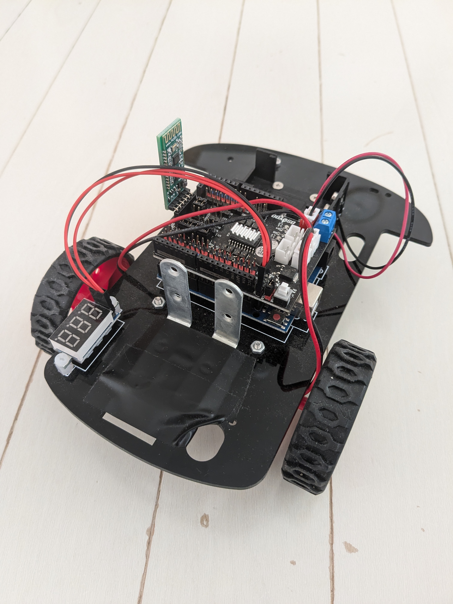

# How to build a robot

## Install RobotVRM app on your phone

Install RobotVRM application on your smartphone by clicking [How to build a development environment for RobotVRM applications](./development.md) or [Download from the store (simple trial version)](../README.md#for-simple-trial-ios-android).

## Robot car preparation

Arduino robot car and HC-02 Bluetooth device preparation. The author purchased an [OSOYOO robot car](https://osoyoo.com/2020/05/22/osoyoo-model-3-v2-0-robot-learning-kit/) for about **US$50**, and the HC-02 is a Bluetooth device that was included in the car.

## Assemble the robot car

Assemble the robot car according to the instructions.

## (Can be omitted but recommended) Confirmation of robot car operation

It is a good idea to install the sample code on the robot car with Arduino according to the instruction manual of the robot car and check its operation. It is also good to confirm the operation of the Bluetooth sample code performed by installing HC-02 on the robot car.

## RobotVRM Arduino code written to robot cars

Please open [this RobotVRM folder](../Arduino) with Arduino and write to the robot car.

* Can I download `RobotVRM.ino` directly or if you want to open it in Arduino, please create `RobotVRM` folder and put `RobotVRM.ino` in it because `RobotVRM/RobotVRM.ino` cannot be opened without RobotVRM folder.

## Create a place on the robot car where the phone can be fixed (anything that can be fixed is fine).

The phone is fixed to the robot car by attaching [the L-shaped bracket](https://watts-online.jp/products/17539?srsltid=AfmBOorxREF7DXRADdJxEtMRO_0XfOGa0fC-jbt4V3DFVtg1LPHPnbcg) to the robot car with the tape that comes with the robot car, and then fastening it with a rubber band as shown in the video.
* Anything will do as long as it can be fixed.

## (Optional but recommended) Extended or unlimited time to suspend the phone.

If the phone suspends while the robot is running, it will stop, so the time until the phone suspends should be extended or unlimited

For Android, Settings app > Display > Screen timeout

For iOS, Settings app > Display & Brightness > Auto-Lock

* If the robot will not be used for a long period of time, it is recommended to restore the original settings

# How to move the robot

## Connect to HC-02 via Bluetooth

With the HC-02 parts connected to the robot car, turn on the power and press the robot icon button in the RobotVRM application to search for HC-02 devices in the vicinity, then select the HC-02 device displayed and connect it to the robot car via Bluetooth.

* See README video

## Fix your phone to a robot car

In the author's case, it is fixed with rubber bands as shown in the README video

* Anything that can be fixed would be fine.

## Turn on the camera

Turn on the camera by pressing the camera icon button as shown in the README video.

※ By default, the camera preview is displayed, but you can hide the preview as shown in the README video by going to the Settings icon button > Advanced Settings > “Hide the preview when camera is on” and turning it ON.

## Wait for the LLM to recognize its surroundings by camera

After turning on the camera, wait about 30 seconds as it takes a little time to throw the first request to the LLM. once the request starts being thrown to the LLM, the robot will move, talk, and change the expression of the VRM in response to the use of the Tool in the LLM.

## Stop robot

You can stop the behavior of the robot by turning off the camera in the RobotVRM application or by exiting the application

## (Other) The system prompts can be adjusted to slightly change the behavioral trends.

You can also change RobotVRM's behavior slightly by changing the contents of the Settings icon button > Character Settings (System Prompt).
